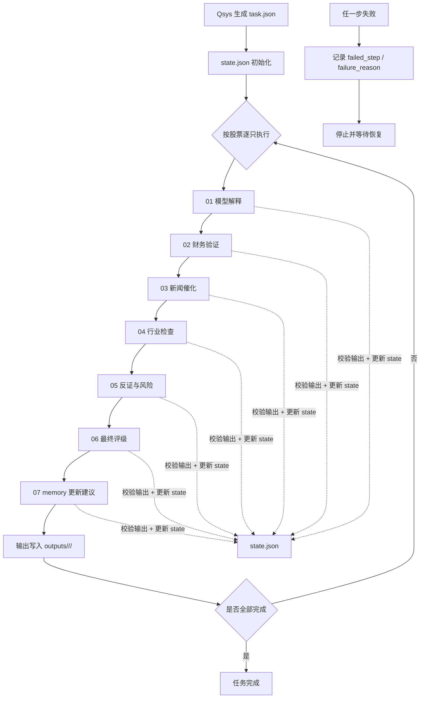

# SysA

`SysA` 是一个面向 `Qsys` 候选股票研究的最小可运行框架。它的使命是**接收 Qsys 的纯数值模型输出（分数 + 因子贡献），叠加外部原始材料（财报、新闻、公告），用 LLM 产出带证据链的结构化研究结论和 A/B/C/D 评级**。

它不是交易系统，也不是内置大模型调用的应用；它的定位是让 Claude Code、Codex 这类代码 agent 按 markdown task 分步执行研究任务，并把全过程 JSON 落盘。

## 定位

- 输入：Qsys 产出的候选股票名单与因子贡献（**纯数值**，不含 NL 解释）+ 外部原始材料（财报模板、新闻摘要、公告）
- 过程：按固定 7 步研究链逐步执行。**Qsys 只能产出数值和结构化标签，所有需要自然语言推理的步骤都在 SysA 中由 agent 完成**
- 输出：结构化 evidence、分步 JSON、最终 A/B/C/D 评级、长期 memory 更新
- 积累：`memory/` 下的 company / industry memory 是 SysA 历次研究积累的长期认知，**不是 Qsys 的产出**
- 边界：不下单、不接交易、不自动给买卖指令

## 总流程图



## 目录说明

- `prompts/`：每一步的研究规则
- `steps/`：给代码 agent 执行的任务文件
- `schemas/`：JSON schema 契约
- `tasks/`：任务包、sample 输入与状态文件
- `outputs/`：按股票拆分的分步输出
- `evidence/`：原始证据、解析证据、agent 产出证据
- `memory/`：公司与行业长期认知
- `tools/`：两个很薄的本地工具

## 使用方式

1. 让 `Qsys` 生成 `tasks/<task_id>/task.json`
2. 初始化 `tasks/<task_id>/state.json`
3. 按 `steps/run_chain.task.md` 执行，或手动按 `01 -> 07` 顺序逐步执行
4. 每一步把输出写入 `outputs/<task_id>/<ts_code>/`
5. 用 `tools/validate_json.py` 校验输出
6. 用 `tools/advance_state.py` 更新 `state.json`
7. 每只股票的最终结论在 `06_final_rating.json`
8. `07_memory_update.json` 只是 memory 更新建议，不自动写回

## Sample 说明

sample 任务位于 `tasks/sample_2026-06-27/`，只用于演示框架，不构成任何投资建议。

示例校验命令：

```bash
python3 tools/validate_json.py \
  schemas/final_rating.schema.json \
  outputs/sample_2026-06-27/000001.SZ/06_final_rating.json
```

示例推进状态命令：

```bash
python3 tools/advance_state.py \
  --state tasks/sample_2026-06-27/state.json \
  --task tasks/sample_2026-06-27/task.json \
  --task-id sample_2026-06-27 \
  --ts-code 000001.SZ \
  --step 01_model_explain \
  --status success
```

## evidence / memory / output

- `evidence`：研究证据层，保留出处、事实抽取和可靠度
- `memory`：长期认知层，只保留稳定、可复用的认知
- `output`：阶段结论层，每步都是结构化 JSON

所有关键判断都必须绑定 `evidence_id`，否则应显式标注 `evidence_insufficient`。

## Git 使用约束

仓库默认只提交框架文件、sample 文件和必要占位文件。

- 运行时产物不要默认入库
- `outputs/`、`evidence/` 下的动态内容应被 `.gitignore` 挡住
- 后续新增真实任务包、真实证据、真实输出时，也应优先保持不入库，除非你明确要做样例沉淀
